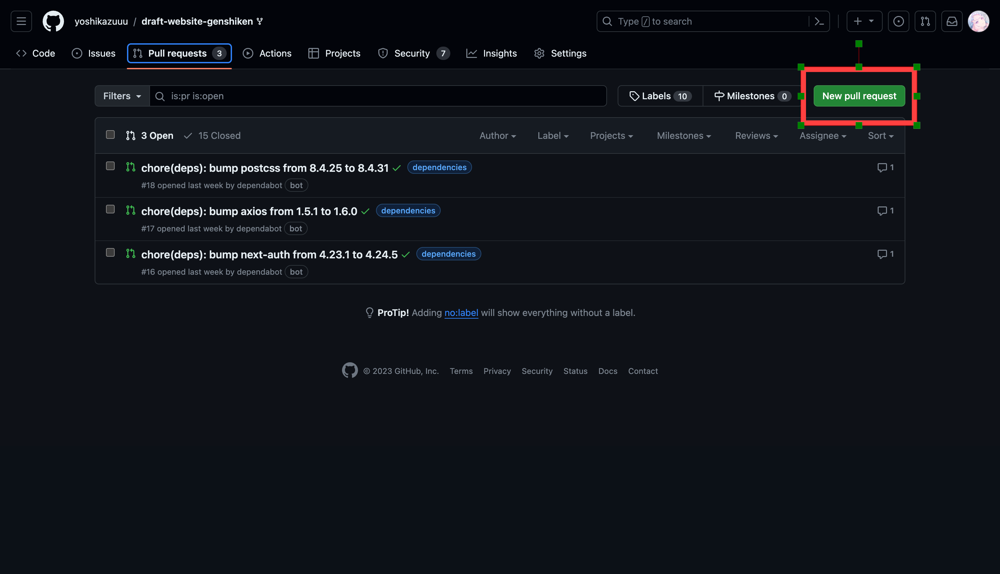
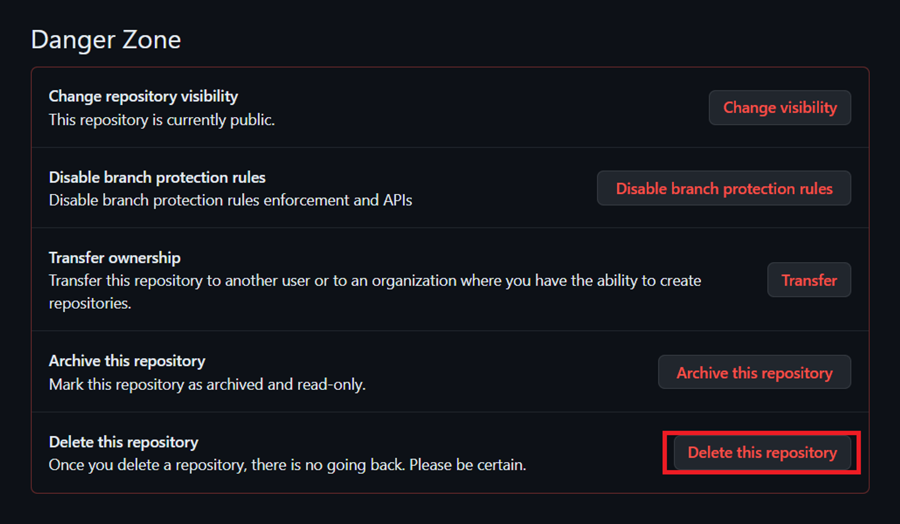

# Git (Version Control)

## Daftar Isi

- [Pendahuluan](#pendahuluan)
- [Apa itu Git?](#apa-itu-git)
- [Terus apa itu GitHub?](#terus-apa-itu-github)
- [Instalasi Git](#instalasi-git)
- [Konfigurasi Git](#konfigurasi-git)
- [Membuat Repositori](#membuat-repositori)
- [Let's Git It On!](#lets-git-it-on)
  - [Membuat Local Repositori](#membuat-local-repositori)
  - [Menambahkan File ke Repositori](#menambahkan-file-ke-repositori)
  - [Menghapus File dari Repositori](#menghapus-file-dari-repositori)
  - [Melihat Perubahan yang Belum Disimpan](#melihat-perubahan-yang-belum-disimpan)
  - [Menghapus Perubahan yang Belum Disimpan](#menghapus-perubahan-yang-belum-disimpan)
  - [Menyimpan Perubahan ke Repositori](#menyimpan-perubahan-ke-repositori)
  - [Melihat Riwayat Perubahan](#melihat-riwayat-perubahan)
  - [Mengembalikan Perubahan](#mengembalikan-perubahan)
  - [Melakukan Perubahan ke Remote Repositori](#melakukan-perubahan-ke-remote-repositori)
  - [Mengambil Perubahan dari Remote Repositori](#mengambil-perubahan-dari-remote-repositori)
  - [Meng-cloning Repositori](#meng-cloning-repositori)
  - [Add Colaborator](#add-colaborator)
  - [Menggunakan Branch](#menggunakan-branch)
  - [Menggunakan Pull Request](#menggunakan-pull-request)
  - [Menggunakan Fork](#menggunakan-fork)
  - [Common Error](#common-error)
- [Quick Recap](#quick-recap)

## Pendahuluan

> [!IMPORTANT]
> 📁 _Version Control_ adalah sebuah sistem yang mencatat segala perubahan yang terjadi pada suatu file maupun kumpulan file *(*seperti folder dan kumpulan folder) yang pada nantinya memperbolehkan user untuk melakukan \**rollback atau recall versi-versi sebelumnya. Karena *Version Control* adalah sebuah sistem, *in theory* kita bisa menggunakkan sistem *Version Control\* pada file apapun di dalam komputer.

Emang gunanya _Version Control_ itu apaan sih?

- rollback/revert perubahan pada file balik ke versi tertentu
- rollback/revert perubahan pada suatu proyek secara keseluruhan balik ke versi tertentu
- Melihat setiap perubahan yang terjadi pada suatu proyek/file dan dapat mengetahui siapakah yang melakukan perubahan itu (review changes).
- Intinya kalo kita menggunakan _Version Control_ terus misal kita melakukan kesalahan kaya ga sengaja ke delete filenya atau "tiba-tiba" code kalian kok gabisa dijalanin, nah gara-gara ada _Version Control System_ ini buat keep track hal-hal itu jadi jauh lebih mudah.

## Apa itu Git?

<p align="center">
  
</p>

Git adalah salah satu sistem _Version Control_ yang paling populer saat ini. Git dibuat oleh Linus Torvalds, yang juga merupakan pembuat kernel Linux. Git merupakan sistem _Version Control_ yang bersifat _distributed_, artinya setiap komputer yang terhubung dengan Git memiliki salinan lengkap dari seluruh _repository_ yang terhubung dengan Git tersebut. Git juga bersifat _open source_, sehingga siapapun dapat mengembangkan Git sesuai dengan kebutuhannya.

## Terus apa itu GitHub?

<p align="center">
  
</p>

GitHub adalah sebuah layanan _hosting_ yang menyediakan _repository_ Git secara gratis. GitHub juga menyediakan fitur _issue tracking_, _pull request_, _project management_, dan lain-lain. GitHub juga menyediakan _private repository_ untuk pengguna yang berbayar.

## Instalasi Git

Link download: [https://git-scm.com/downloads](https://git-scm.com/downloads)


Setelah instalasi selesai jalankan command berikut dalam Command Prompt untuk Windows dan Terminal bagi Mac.

```bash
git --version
```

Apabila instalasi berhasil maka command tersebut akan menunjukkan git versi berapa yang sudah terinstall di PC kalian, seperti pada gambar berikut.


## Konfigurasi Git

Pertama2 kita harus melakukan konfigurasi akun git terlebih dahulu, kalian dapat menggunakkan akun Github kalian untuk melanjutkan proses ini.

```bash
# Command
git config --global user.name [username]
git config --global user.email [isi@email.com]

# Misal username github anda mecoder
# Misal email github anda coder@gmail.com
# Contoh
git config --global user.name mecoder
git config --global user.email coder@gmail.com

# Untuk melihat akun yang sudah terdaftar dalam Git
git config --global --list
```

## Membuat Repositori

Repositori adalah tempat dimana kita menyimpan file-file yang akan kita track menggunakan Git. Untuk membuat repositori, kita dapat menggunakan command berikut.

1. Buka github kalian di https://github.com
2. Klik button new (warna hijau)
   
3. Ketik nama repository yang kalian inginkan dan tentukan apakah repository ini bisa diakses secara public atau private
   
4. Jika sudah terisi semua, klik create repository
   

5. **Let's Git It On!**

   Sekarang buatlah satu folder yang akan digunakkan untuk mulai meng-_initialize_ git, dan buka Command Prompt / Terminal dalam folder tersebut.

   Cara membuka Command Prompt / Terminal dalam suatu folder.

   - Untuk Windows : https://www.lifewire.com/open-command-prompt-in-a-folder-5185505
   - Untuk Mac : https://www.maketecheasier.com/launch-terminal-current-folder-mac/

   Menggunakkan command "cd" untuk menavigasikan Command Prompt ke folder yang diinginkan

   - https://www.howtogeek.com/659411/how-to-change-directories-in-command-prompt-on-windows-10/

6. **Membuat Local Repository (git init)**

   ```bash
   git init
   ```

7. **Menambahkan File (git add)**

   ```bash
   #Command
   git add .
   #digunain untuk nambahin semua file untuk di commit

   git add [nama file]
   #digunain untuk nambah satu file spesifik

   #Misal nama file yang ingin ditambah home.css
   #Contoh
   git add home.css
   ```

8. **Menyimpan Perubahan (git commit)**

   ```bash
   #Command
   git commit -m "[pesan commitnya]"

   #Misal abis koding nambahin section contactus
   #Contoh
   git commit -m "added contact us section"
   ```

9. **Menyambungkan Local Repo —> Remote Repo(Repository Github) (git remote)**

   ```bash
   #Command
   git remote add origin [link_repo_taro_sini]
   git branch -M [nama_branch]

   #Contoh
   git remote add origin https://github.com/joshuajevon/training-git.git
   git branch -M main
   ```

   Link repo bisa didapat dari gambar yang terlampir dibawah ini

   

10. **Meng-upload Local Repository ke Github (git push)**

    ```bash
    #Command
    git push -u origin main
    #Melakukan upload dari local ke remote repo ke dalam branch main
    #Command ini dilakukan apabila kalian melakukan init git di local terlebih dahulu

    #Atau biasanya kalian hanya perlu menjalankan command ini
    git push
    ```

## Menambahkan Kolaborator

1. Langkah pertama adalah mendapatkan username dari calon kolaborator. Apabila belum memiliki username, maka harus terlebih dahulu mendaftar melalui link berikut “[Signing up for a new GitHub account](https://help.github.com/en/articles/signing-up-for-a-new-github-account)“.

1. Silahkan mengakses halaman utama dari repository pada GitHub.

1. Klik tombol **Settings** yang terdapat di bawah nama repository name.
   

1. Klik link **Collaborators** yang tampil pada menu di bagian kiri
   

1. Masukkan **password** akun GitHub Anda untuk melanjutkan proses.
   

1. Tekan **Add People**.
   

1. Masukkan username dari calon kolaborator dan tekan **nama mereka**.
   

1. Tekan **Add [username] to this repository**.
   

1. Kolaborator akan mendapatkan email notifikasi yang berisi link untuk konfirmasi. Apabila konfirmasi dilakukan maka calon kolaborator tersebut akan menjadi kolaborator dan dapat mengakses repository yang terkait.
   
   

## Berkontribusi ke Repositori Orang Lain

1. **Fork Repository**

   
   

2. **Clone Repository**

   ```bash
   #Command
   git clone [link_repo_taro_sini]
   ```

3. **Membuat Branch Baru**

   ```bash
    #Command
    git branch [nama_branch]
    #Misal nama branch yang ingin dibuat contactus
    #Contoh
    git branch contactus
   ```

4. **Pindah ke Branch Baru**

   ```bash
    #Command
    git checkout [nama_branch]
    #Misal nama branch yang ingin dipindah contactus
    #Contoh
    git checkout contactus
   ```

5. **Membuat Perubahan**

   ```bash
     #Command
     git add .
     git commit -m "[pesan commitnya]"
     #Misal abis koding nambahin section contactus
     #Contoh
     git add .
     git commit -m "added contact us section"
   ```

6. **Push Perubahan ke Branch Baru**

   ```bash
     #Command
     git push origin [nama_branch]
     #Misal nama branch yang ingin dipindah contactus
     #Contoh
     git push origin contactus
   ```

7. **Buat Pull Request**

   
   

8. **Merge Pull Request/Tunggu Arahan Pemilik Repo**

   

## Menghapus Repository

1. Pilih repo yang ingin kalian hapus
2. Klik setting


3. Scroll ke paling bawah dan klik delete this repository



4. Ketik nama repository yang ingin kita hapus dan klik delete


## Quick Recap

```bash
#NOTES : Kalo ada [ ] pas gunain commandnya [ ] nya ilangin
#Example : git commit -m "[pesan yang dikirim apa]"
#Pake commandnya : git commit -m "added section on about page"

#Basic flow kalo gunain git:
git add .
git commit -m "[pesan yang dikirim apa]"
git push

#Clone repository dari Github/Gitlab
git clone [link_repo_taro_sini]

#Konek-in Local Repo ke Remote Repo
git remote add origin [link_repo_taro_sini]
git branch -M main
git push -u origin main
git checkout [nama-branch]

#Get latest updates di repo
git pull

#NOTES --> Jangan lupa git add dan git commit dulu sebelum git pull, kalo lagi ada yang dikerjain. Git pull itu gabungan git fetch dan git merge, jadi kalo dia nge-merge dan masih ada unsaved changes di file2nya, dia bakal nge-overwrite file2nya dan hal yang masih dikerjain tadi bisa hilang
```
